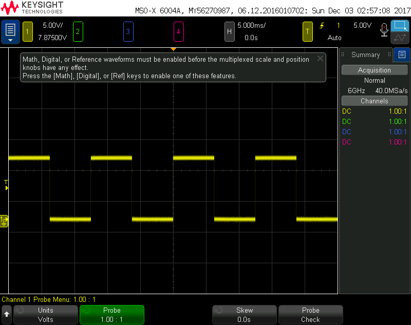

# Lab 6: "High Power" Control
This lab was performed using a wave form generator to generate 5 volt square wave signals between 0 and 5 volts at 50 to 120 Hz.
## Relays
A circuit was designed in which a relay is used to switch the power on and off of a power ressistor. The maximum switching fequency of the relay was 120 Hz. The relay did switch all the way up to 250 Hz for a short amount of time before it stopped switching. At 120 Hz the relay's performance was consistant. This was judged based on the ouput observed on the oscilliscope. The current draw of the switching source for a relay is between 1 and 30 mA. To guarantee that the realy will not draw too much current to break the MSP430 pin, a MOSFET can be used to switch the relay.

## MOSFET
The current draw when using the MOSFET to control the system was bellow 1 uA. The downside of using a MOSFET to switch a current is that the MOSFET's we are using can only switch smaller currents while the relay can switch 120v rms at 10 Amps. 

## Optimal Switching Design
It was found that when switching high currents the best configuration is using a MOSFET to switch the MSP430's PWM signal and then use the output of the MOSFET to drive the relay which is able to switch very large currents. By using the MOSFET to switch the relay the MSP430 is isolated from the relay and the current draw from the pin should be almost zero as there is an infinate impedance across the MOSFET.

## Screen Shots of the Relay output and MSP430 Output
Bellow is the input of the relay and the output of the relay at 50 Hz.

At 80 Hz

At 100 Hz

