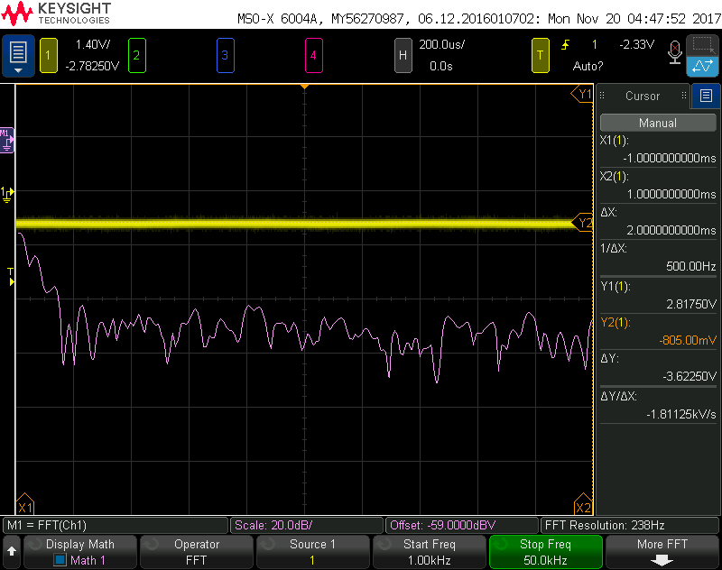
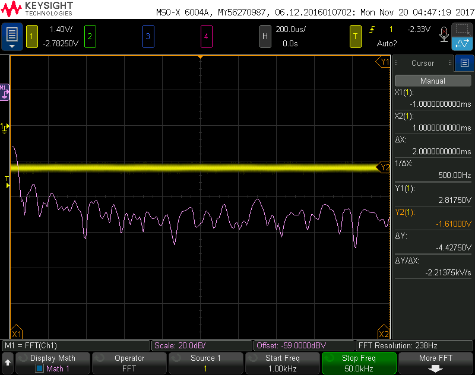
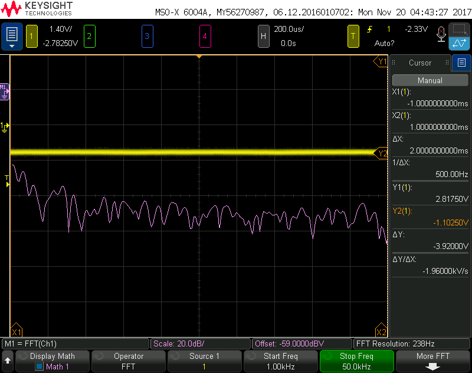
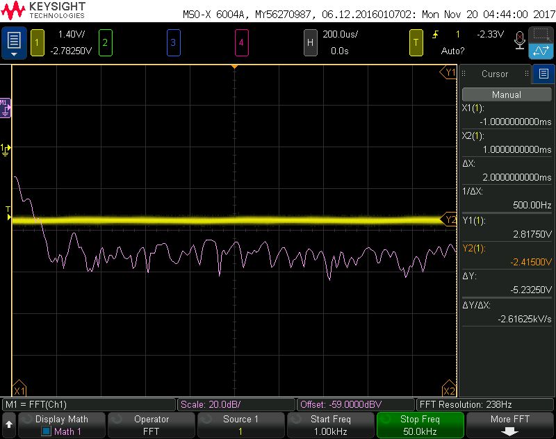
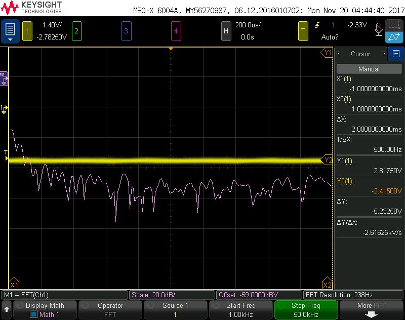
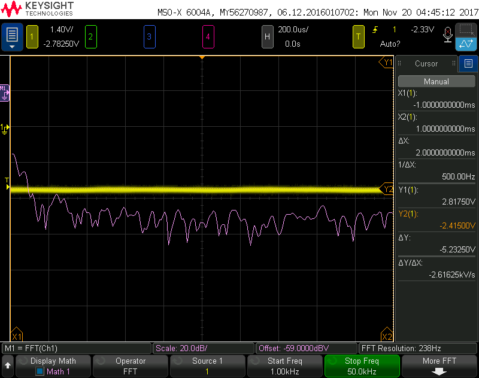
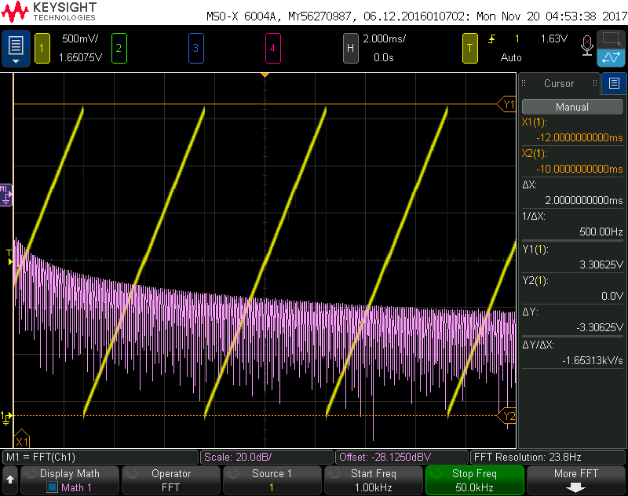
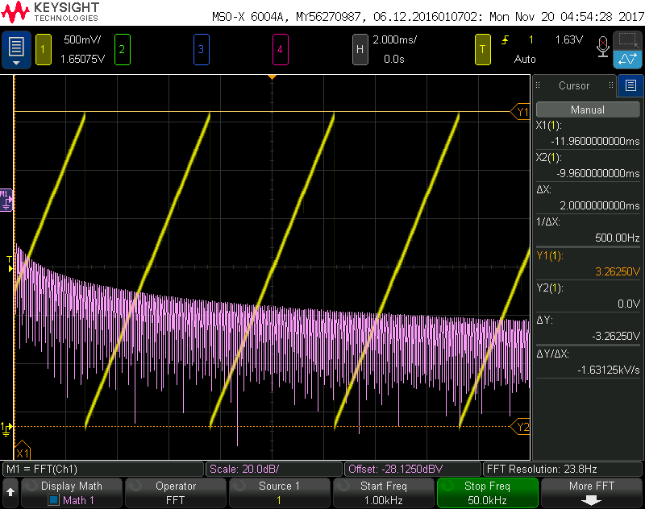
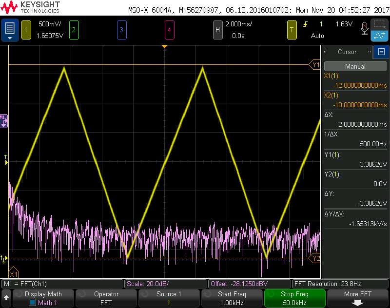
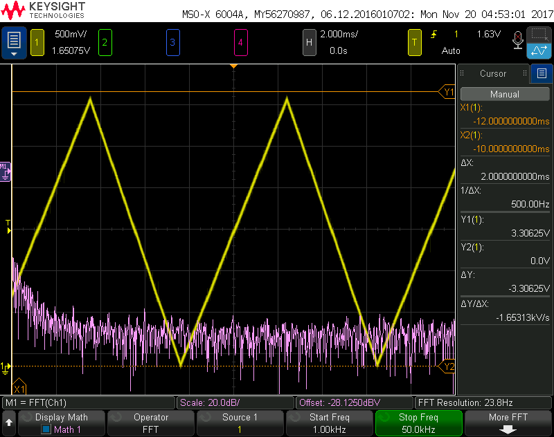

# Lab 6: Percision Control
## PWM Part 2
In the folder "Lab6PercisionControlPWM" are the files which use a Pulse Modulated Signal to generate a constant voltage. A low pass filter was made and the output of this can be seen in the images bellow. All of these images are from the unloaded circuit.

When a load was applied the signal was pulled low so we needed to create an active low pass filter, after the active low pass filter was created the bellow images was taken with loads of 100, 1k, 10k, and 100k.

## R2R Ladder
An R2R ladder was made so that digital signals could be used to create an analog voltage. The voltage can be seen in a ramp and triange wave form both loaded and unloaded. The triangle wave was created by incrementing and decrementing a port of outputs on the MSP430F5529.

